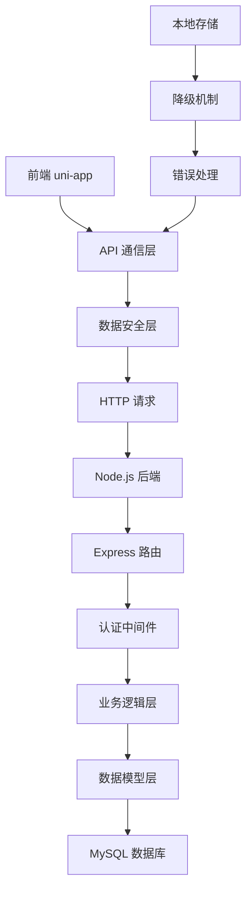

# PencilParty 游戏项目 - 数据库集成方案

## 📋 项目概述

PencilParty 是一个基于 uni-app 框架的跨平台游戏应用，支持 H5、小程序、App 等多个平台。本项目提供了完整的数据库集成方案，包括后端 API 服务、前端通信模块、数据安全传输、错误处理和降级机制等。

## 🏗️ 系统架构



## 🚀 快速开始

### 环境要求

- Node.js >= 16.0.0
- MySQL >= 8.0
- npm >= 8.0.0

### 后端部署

1. **克隆项目**
```bash
git clone <repository-url>
cd PencilParty-Guess
```

2. **安装后端依赖**
```bash
cd server
npm install
```

3. **配置环境变量**
```bash
cp .env.example .env
```

编辑 `.env` 文件：
```env
# 服务器配置
PORT=3000
NODE_ENV=development

# 数据库配置
DB_HOST=localhost
DB_PORT=3306
DB_USER=root
DB_PASSWORD=your_password
DB_NAME=pencilparty

# JWT配置
JWT_SECRET=your_super_secret_key_here
JWT_EXPIRES_IN=7d

# CORS配置
CORS_ORIGIN=http://localhost:8080,http://localhost:3000
```

4. **创建数据库**
```bash
mysql -u root -p < database/schema.sql
```

5. **启动后端服务**
```bash
# 开发模式
npm run dev

# 生产模式
npm start
```

### 前端部署

1. **安装前端依赖**
```bash
cd uni-preset-vue-vite
npm install
```

2. **配置 API 地址**
编辑 `src/config/api.js` 文件，根据环境设置正确的 `baseURL`

3. **启动开发服务器**
```bash
npm run dev:h5
```

## 📁 项目结构

```
PencilParty-Guess/
├── server/                     # 后端服务
│   ├── app.js                 # 主应用文件
│   ├── package.json            # 后端依赖
│   ├── .env.example           # 环境变量模板
│   ├── config/
│   │   └── database.js        # 数据库配置
│   ├── database/
│   │   └── schema.sql          # 数据库结构
│   ├── middleware/
│   │   └── auth.js           # 认证中间件
│   ├── models/
│   │   ├── User.js            # 用户模型
│   │   └── GameRecord.js      # 游戏记录模型
│   └── routes/
│       ├── auth.js            # 认证路由
│       └── games.js           # 游戏路由
├── uni-preset-vue-vite/         # 前端应用
│   ├── src/
│   │   ├── config/
│   │   │   ├── api.js        # API 配置
│   │   │   └── index.js      # 应用配置
│   │   ├── services/
│   │   │   ├── authService.js    # 认证服务
│   │   │   └── gameService.js   # 游戏服务
│   │   ├── utils/
│   │   │   ├── request.js     # HTTP 请求工具
│   │   │   ├── storage.js     # 存储工具
│   │   │   ├── crypto.js      # 加密工具
│   │   │   ├── platform.js   # 平台兼容
│   │   │   └── errorHandler.js # 错误处理
│   │   └── pages/
│   │       ├── home/           # 首页
│   │       └── profile/        # 个人资料页
│   └── package.json            # 前端依赖
└── README.md                   # 项目文档
```

## 🔧 核心功能

### 1. 用户认证系统

- **JWT Token 认证**：支持访问令牌和刷新令牌
- **多平台登录**：支持微信、支付宝等平台登录
- **自动刷新**：Token 过期时自动刷新
- **安全登出**：清除本地认证信息

### 2. 数据库操作

- **用户管理**：用户信息、偏好设置、等级系统
- **游戏记录**：游戏开始/结束、分数统计、排行榜
- **数据完整性**：事务处理、数据验证、错误恢复

### 3. 安全传输

- **数据加密**：AES-GCM 加密敏感数据
- **数字签名**：HMAC-SHA256 验证数据完整性
- **防重放**：时间戳和 Nonce 机制
- **数据脱敏**：敏感信息自动脱敏

### 4. 错误处理

- **重试机制**：指数退避算法智能重试
- **降级策略**：网络失败时自动降级到本地存储
- **错误上报**：自动收集和上报错误信息
- **健康检查**：实时监控应用健康状态

### 5. 跨平台兼容

- **统一接口**：各平台 API 调用统一封装
- **能力检测**：自动检测平台功能支持
- **降级方案**：不支持功能时提供替代方案
- **平台优化**：针对不同平台进行性能优化

## 📊 API 接口文档

### 认证接口

| 方法 | 路径 | 描述 | 参数 |
|------|------|------|------|
| POST | `/api/auth/login` | 用户登录 | openid, nickname, avatar |
| POST | `/api/auth/refresh` | 刷新令牌 | refreshToken |
| GET | `/api/auth/me` | 获取用户信息 | - |
| PUT | `/api/auth/profile` | 更新用户资料 | profile data |

### 游戏接口

| 方法 | 路径 | 描述 | 参数 |
|------|------|------|------|
| GET | `/api/games/types` | 获取游戏类型 | - |
| GET | `/api/games/popular` | 获取热门游戏 | limit |
| POST | `/api/games/start` | 开始游戏 | game_type, room_id |
| POST | `/api/games/finish` | 结束游戏 | game_id, score, result |
| GET | `/api/games/records` | 获取游戏记录 | game_type, limit, offset |
| GET | `/api/games/leaderboard` | 获取排行榜 | game_type, rank_type, limit |

### 响应格式

```json
{
  "success": true,
  "message": "操作成功",
  "data": {
    // 具体数据
  }
}
```

```json
{
  "success": false,
  "message": "操作失败",
  "code": "ERROR_CODE",
  "data": null
}
```

## 🔒 安全配置

### JWT 配置

```javascript
// 服务器端
const jwtConfig = {
  secret: 'your_super_secret_key_here', // 至少32字符
  expiresIn: '7d',                 // 令牌有效期
  algorithm: 'HS256'                // 签名算法
}

// 客户端
const tokenConfig = {
  refreshThreshold: 0.8,  // 80%时间时刷新
  maxRetries: 3,        // 最大重试次数
  retryDelay: 1000       // 重试延迟(ms)
}
```

### 数据加密

```javascript
// 敏感数据加密
const encryptedData = await encrypt({
  userId: '123',
  score: 1000,
  timestamp: Date.now()
})

// 数据签名验证
const signature = await generateSignature(data)
const isValid = await verifySignature(data, signature)
```

## 🛠️ 开发指南

### 添加新的 API 接口

1. **创建数据模型**
```javascript
// server/models/NewModel.js
class NewModel {
  async create(data) {
    // 创建逻辑
  }
  
  async findById(id) {
    // 查询逻辑
  }
}

module.exports = new NewModel()
```

2. **创建路由**
```javascript
// server/routes/newRoute.js
const express = require('express')
const router = express.Router()
const NewModel = require('../models/NewModel')

router.get('/', async (req, res) => {
  const result = await NewModel.getAll()
  res.json({ success: true, data: result })
})

module.exports = router
```

3. **注册路由**
```javascript
// server/app.js
const newRoute = require('./routes/newRoute')
app.use('/api/new', newRoute)
```

4. **创建前端服务**
```javascript
// src/services/newService.js
import { get, post } from '@/utils/request'

class NewService {
  async getAll() {
    const response = await get('/new')
    return response.success ? response.data : null
  }
}

export default new NewService()
```

### 添加新的游戏类型

1. **数据库添加**
```sql
INSERT INTO game_types (name, code, icon, description) 
VALUES ('新游戏', 'new-game', '🎮', '新游戏描述');
```

2. **前端配置**
```javascript
// src/utils/platform.js
const gameIcons = {
  'new-game': '🎮'
}
```

## 🔧 配置说明

### 环境变量

| 变量名 | 描述 | 默认值 |
|--------|------|--------|
| PORT | 服务器端口 | 3000 |
| NODE_ENV | 运行环境 | development |
| DB_HOST | 数据库主机 | localhost |
| DB_PORT | 数据库端口 | 3306 |
| DB_USER | 数据库用户名 | root |
| DB_PASSWORD | 数据库密码 | - |
| DB_NAME | 数据库名称 | pencilparty |
| JWT_SECRET | JWT 密钥 | - |
| CORS_ORIGIN | 允许的域名 | localhost |

### 前端配置

```javascript
// src/config/index.js
export default {
  api: {
    baseURL: 'http://localhost:3000/api',
    timeout: 10000,
    retryTimes: 3
  },
  
  features: {
    enableAnalytics: true,
    enablePush: true,
    enableShare: true
  },
  
  security: {
    enableEncryption: true,
    tokenRefreshThreshold: 0.8
  }
}
```

## 🚀 部署指南

### 开发环境

1. **后端**
```bash
cd server
npm run dev
```

2. **前端**
```bash
cd uni-preset-vue-vite
npm run dev:h5
```

### 生产环境

#### 后端部署

1. **使用 PM2**
```bash
npm install -g pm2
cd server
pm2 start app.js --name "pencilparty-server"
```

2. **使用 Docker**
```dockerfile
FROM node:16-alpine
WORKDIR /app
COPY package*.json ./
RUN npm ci --only=production
COPY . .
EXPOSE 3000
CMD ["npm", "start"]
```

```bash
docker build -t pencilparty-server .
docker run -d -p 3000:3000 pencilparty-server
```

#### 前端部署

1. **H5 部署**
```bash
npm run build:h5
# 将 dist 目录部署到 Web 服务器
```

2. **小程序部署**
```bash
npm run build:mp-weixin
# 使用微信开发者工具上传 dist 目录
```

3. **App 部署**
```bash
npm run build:app-plus
# 使用 HBuilderX 打包发行
```

### Nginx 配置

```nginx
server {
    listen 80;
    server_name your-domain.com;
    
    # 前端静态文件
    location / {
        root /path/to/dist;
        try_files $uri $uri/ /index.html;
    }
    
    # API 代理
    location /api/ {
        proxy_pass http://localhost:3000;
        proxy_set_header Host $host;
        proxy_set_header X-Real-IP $remote_addr;
    }
}
```

## 📈 性能优化

### 后端优化

1. **数据库连接池**
```javascript
const pool = mysql.createPool({
  connectionLimit: 10,
  acquireTimeout: 60000,
  timeout: 60000
})
```

2. **缓存策略**
```javascript
// Redis 缓存
const cache = require('redis').createClient()
await cache.setex(`user:${id}`, 300, userData)
```

3. **压缩中间件**
```javascript
const compression = require('compression')
app.use(compression())
```

### 前端优化

1. **请求缓存**
```javascript
// src/utils/request.js
const cache = new Map()
const cacheKey = `${method}:${url}:${JSON.stringify(params)}`

if (cache.has(cacheKey)) {
  return cache.get(cacheKey)
}
```

2. **图片懒加载**
```javascript
// 图片懒加载组件
const LazyImage = {
  props: ['src'],
  mounted() {
    const observer = new IntersectionObserver((entries) => {
      if (entries[0].isIntersecting) {
        this.loadImage()
      }
    })
    observer.observe(this.$el)
  }
}
```

## 🔍 监控和日志

### 错误监控

```javascript
// src/utils/errorHandler.js
export const reportError = (error) => {
  // 上报到监控系统
  fetch('/api/errors/report', {
    method: 'POST',
    body: JSON.stringify(error)
  })
}
```

### 性能监控

```javascript
// 性能指标收集
const performanceObserver = new PerformanceObserver((list) => {
  for (const entry of list.getEntries()) {
    console.log(`${entry.name}: ${entry.duration}ms`)
  }
})
performanceObserver.observe({ entryTypes: ['measure'] })
```

## 🧪 测试

### 后端测试

```bash
cd server
npm test
```

### 前端测试

```bash
cd uni-preset-vue-vite
npm run test
```

### API 测试

```bash
# 使用 Postman 或 curl 测试
curl -X POST http://localhost:3000/api/auth/login \
  -H "Content-Type: application/json" \
  -d '{"openid":"test123","nickname":"测试用户"}'
```

## 📝 更新日志

### v1.0.0 (2024-12-14)

#### 新增功能
- ✅ 完整的数据库集成方案
- ✅ JWT 认证系统
- ✅ 游戏记录和排行榜
- ✅ 数据安全传输机制
- ✅ 跨平台兼容性支持
- ✅ 错误处理和降级机制
- ✅ 配置管理系统

#### 技术栈
- 后端：Node.js + Express + MySQL
- 前端：uni-app + Vue 3 + Vite
- 安全：JWT + AES-GCM + HMAC-SHA256
- 工具：npm + Git + Docker

## 🤝 贡献指南

1. Fork 项目
2. 创建功能分支 (`git checkout -b feature/AmazingFeature`)
3. 提交更改 (`git commit -m 'Add some AmazingFeature'`)
4. 推送到分支 (`git push origin feature/AmazingFeature`)
5. 打开 Pull Request

## 📄 许可证

本项目采用 MIT 许可证 - 查看 [LICENSE](LICENSE) 文件了解详情。

## 📞 支持

如果您遇到问题或有建议，请：

1. 查看 [FAQ](docs/FAQ.md)
2. 搜索 [Issues](../../issues)
3. 创建新的 [Issue](../../issues/new)

## 🙏 致谢

感谢所有为这个项目做出贡献的开发者！

---

**Happy Coding! 🎮**
